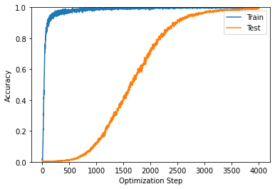

## Small NN Generalization

The code in this repo evaluates the performance of transformer architectures on small, mathematical datasets. It is based on this [paper](https://mathai-iclr.github.io/papers/papers/MATHAI_29_paper.pdf). Even with these small datasets, you can see some strange generalization phenomena unique to the overparametrized regime. The first plot shows train/test accuracy over optimization steps for the modular subtraction data. After completely overfitting the training data, you suddenly see the test performance shoot up. For other datasets like composition of permutations, this jump happens order of magnitudes of steps after the neural net has memorized the training data. There is not a precise theoretical explanation of this behavior, but current thinking suggests that some combination of weight decay and SGD's algorithmic regularization properties may force the training process towards a "smooth" interpolating solution, i.e. a flat local minimum, which can still have good generalization behavior. The second plot shows the well-documented double descent curve.




It would be interesting to see the results as you increase the amount of noise in the training data. To run that analysis, change the ```outlier_size``` argument in the ```run_configs.yaml```.

To train/test the models, run the ```main.py``` script. Settings are handled with ```hydra``` and you can add a custom yaml file to the ```config``` directory.
